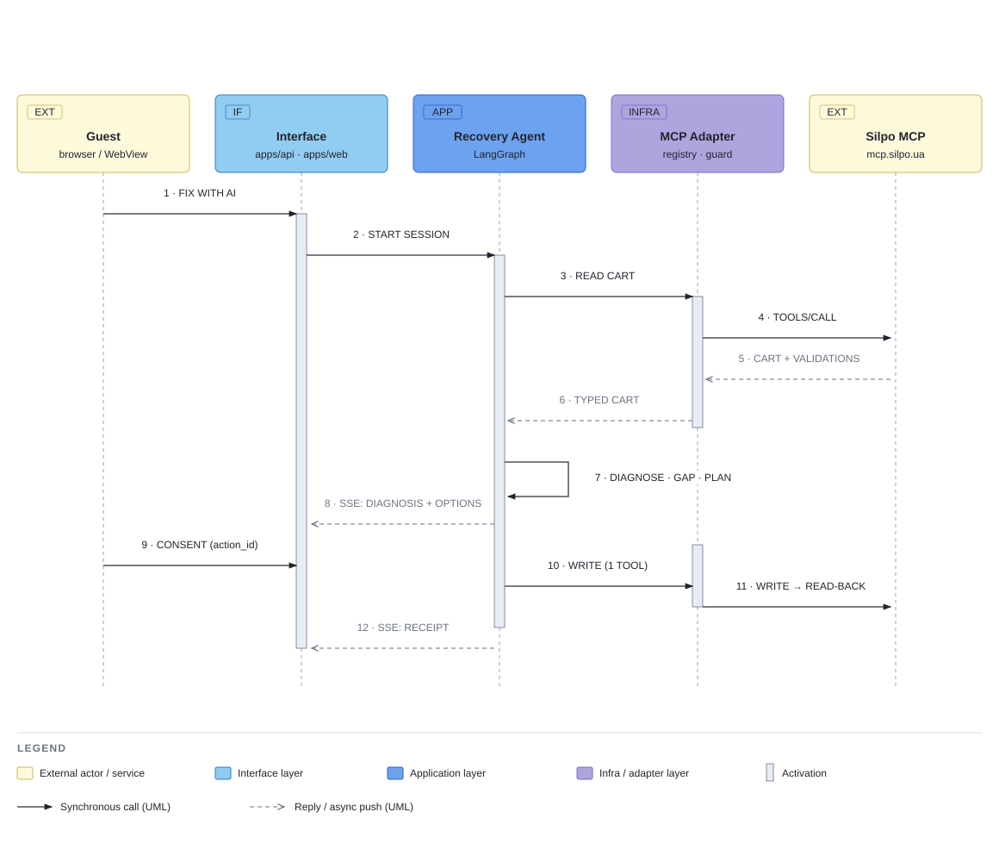
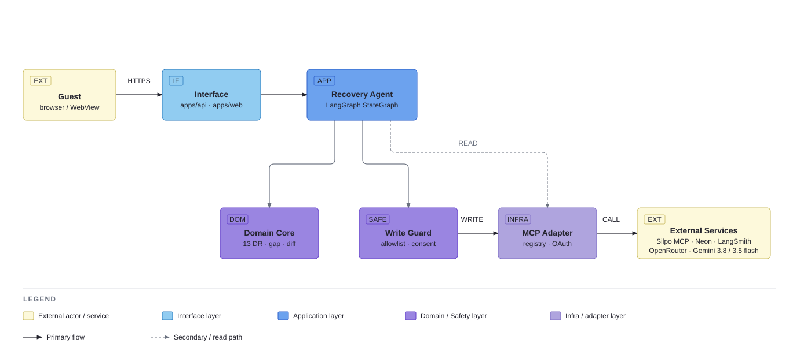

# Lantern — Checkout Transparency Agent for Silpo

**Ліхтарик** helps a Silpo guest understand and resolve a blocked cart before checkout.
It reads the cart through Silpo's official MCP server, explains every validation the
cart contains — including the ones the app's own screen never renders — calculates the
exact gap, suggests relevant products, and changes the cart only after explicit,
item-specific consent. Every change is proven by reading the cart back.

The agent never checks out or pays on behalf of the guest.

**Live demo:** https://silpo-lantern.onrender.com/ (a guest logs in at Silpo's own page;
one credential per session, deletable with «Вийти»)
**Full report with every diagram:** [`docs/reports/index.html`](docs/reports/index.html)

## Why it matters

At checkout a guest sees one generic message — «додайте товарів на X ₴» — while the
server already returns several structured validations, one of which the app shows on no
screen a guest can reach (audited 2026-09-10). Lantern makes that information
actionable:

`blocked cart → diagnosis → concrete options → consent → minimal change → read-back receipt`

The MVP covers one recovery path, the minimum-order-sum blocker, plus a read-only
delivery-channel comparison. Detail: [`docs/reports/hero-run.html`](docs/reports/hero-run.html).

## How the recovery works

1. **Read and diagnose.** The agent reads the cart and exposes all validations, not only
   the first blocker the UI shows.
2. **Plan.** It computes the shortfall in code and proposes 2–3 products from live MCP
   search data, quantity derived from the measured gap.
3. **Ask for consent.** Consent is bound to one proposed action and the cart state at
   that moment (two hashes, a five-minute expiry).
4. **Guard the write.** The Write Guard — the only place a write tool can be called —
   re-checks everything and authorises exactly one allowlisted MCP call, or refuses
   with a reason.
5. **Prove the outcome.** An independent read-back produces a receipt: expected change,
   actual change, whether the blocker was cleared.



## Safety by design

- Only the **Write Guard** node can call a write tool; the model plans and explains,
  never authorises.
- Prices, identifiers and quantities come from live cart and search data; the
  quantity is computed from the measured gap.
- Consent expires and does not survive a change of the cart state.
- The MCP tool list is discovered live through `tools/list`, hashed per tool, and a new
  or changed tool is quarantined until reviewed.
- The session is an `HttpOnly; Secure; SameSite=Lax` cookie; logout deletes the stored
  credential; idle credentials expire after 30 minutes.
- Raw captures stay local; fixtures are sanitised; secret scanning runs in the gate.

Detail, with the guard-refusal and compensation sequences and the RG-01…07 regression
map: [`docs/reports/safety.html`](docs/reports/safety.html).

## Architecture

One FastAPI service serves the API and the built React console. A LangGraph graph runs
read → diagnose → plan → consent → guarded write → read-back. Neon Postgres holds every
piece of state; Silpo MCP is the only commerce integration.



Data model (six tables, keys and relationships):
[`docs/reports/data-model.html`](docs/reports/data-model.html).

## Evidence and current result

The hero flow has been walked live through the browser (2026-09-10): a cart **93.38 ₴**
below the **699 ₴** minimum, consent to `31.99 ₴ × 3`, read-back confirmed the expected
**+95.97 ₴** and a cleared blocker; the session spent 5,205 tokens ($0.0042). The cart
was restored afterwards.

| Signal | Result | What it means |
|---|---:|---|
| Offline gate | 715 tests | Domain rules, guard, API and graph are checked without MCP, LLM or Postgres. |
| Live repeats | 18 / 18 | Eighteen live end-to-end runs on 2026-09-09 reached a verified receipt. |
| Unauthorized writes | 0 / 33, 95% [0.00, 0.10] | No observed bypass — evidence, not proof of impossibility. |
| Read-back coverage | 33 / 33, 95% [0.90, 1.00] | Every tested write was independently re-read. |
| Model cost | ≈ $0.007 per episode | Measured over 18 live runs; $0.13 in total. |

All eight metrics with `n`, 95% Wilson intervals and caveats, the results chart and the
command that regenerates them: [`docs/reports/metrics.html`](docs/reports/metrics.html).

**Not measured:** conversion uplift, revenue impact, and moderated guest sessions
(n = 0). They need Silpo's analytics and a controlled pilot, and are not inferred from
technical tests. The replay fallback exists as tracked recorded bundles replayed by
`tests/e2e`, not as a mode of the interface; every demonstration is live.

## Unit economics

Stated as the plan's formula with variables, not a projection:

`Vnet = B × (p₁ × M₁ − p₀ × M₀ − c) + ΔS × C − F`

B — recovery-eligible episodes; p₁/p₀ — completed purchases with and without the agent;
M₁/M₀ — marginal contribution per purchase; c — the agent's variable cost per episode;
ΔS — support contacts avoided; C — cost of one; F — fixed integration cost. **Only c is
measured** (≈ $0.007). At c ≈ $0.01 the agent pays for itself if one recovered purchase
in a hundred episodes carries more than one dollar of margin — provided p₁ − p₀ > 0,
which is what the A/B pilot over eligible episodes would establish.

## Run locally

Copy `.env.example` to `.env`, set `DATABASE_URL` (`postgresql+psycopg://…`), then:

```bash
make run                # API, migrations, checkpointer, GET /health; serves apps/web/dist at /
make web-build          # npm ci && npm run build in apps/web
make gate               # black, flake8, mypy, unit + contract tests; no network
make test-integration   # needs DATABASE_URL
make openapi            # regenerate apps/api/openapi.json
make report             # regenerate the report pages
make secret-scan
```

`make run` uses `python -m apps.api` rather than `uvicorn` directly: on Windows uvicorn
picks an event loop the async Postgres driver refuses. The service pins Python 3.12.10.

## Scope and limitations

One recovery path for a minimum-order blocker, plus a read-only delivery comparison. No
second chat interface, no runtime web search, no autonomous checkout, payment or age
confirmation. New blockers (stock, timeslot) are added only after ten sanitised cases
and a deterministic rule each. The value hypothesis — fewer abandoned carts and support
contacts — remains to be tested with an A/B pilot on eligible checkout episodes.

Reused components from the donor project, third-party notices and the disclosure of
AI assistance are delivered with the submission package.

## License

See [`LICENSE`](LICENSE).
