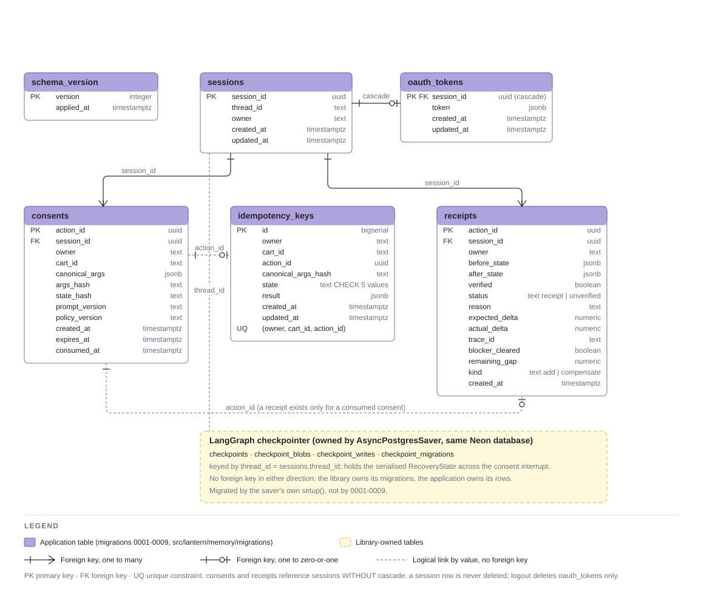

# Lantern — Checkout Transparency Agent for Silpo

**Ліхтарик** in the Ukrainian UI and pitch. When a guest's Silpo cart is blocked by a
checkout rule, Lantern reads the live cart through Silpo's official MCP server, surfaces
every validation the cart already carries — including ones the app's own screen never
renders — computes the exact gap to checkout, proposes 2–3 relevant products, and, only
after the guest's explicit consent to one specific plan, performs the minimal cart change
and proves the outcome by reading the cart back. Checkout and payment stay the guest's
own action, always.

**What it solves, in one paragraph.** A guest's cart is blocked at the last step of the
funnel; the app says «add items for X ₴» and nothing else, while the server already knows
every constraint — including one the app never renders. Lantern turns that into one
action with a proof: exact gap → 2–3 concrete products → consent to one of them → one
guarded write → the cart read back → a receipt that says what actually changed.

Live: `https://silpo-lantern.onrender.com/` (a guest logs in at Silpo's own page; the
service holds one credential per session, deletable with «Вийти»). Architecture, every
sequence and state diagram, and the value argument: [`docs/reports/index.html`](docs/reports/index.html).

## Architecture

One FastAPI service serves the API and the built React card; a LangGraph graph runs the
recovery; a single Write Guard node is the only place a write tool can be called; the MCP
adapter treats the server's own tool list as untrusted input; Neon Postgres holds every
piece of state.


## The scenario that proves it

The hero: a cart under the minimum order sum. Read → diagnose (every validation, not only
the blocker) → plan → consent bound to one action and one cart state → guarded write →
independent read-back → receipt.


Walked live through the browser on 2026-09-10: gap 93.38 ₴ against a 699 ₴ minimum,
three candidates priced from the product search, consent to one (31.99 × 3), expected
+95.97 and read back +95.97, verified, blocker cleared; the session spent 5,205 tokens
($0.0042). The cart was restored afterwards by script.

## Data model



## Status

Infrastructure, domain core, and the LangGraph read/plan/rank path are complete. The
API starts, runs its database migrations and opens a pooled LangGraph checkpointer
against Postgres; the MCP adapter has a dynamic `tools/list` registry with drift
detection and schema-hash quarantine, a typed error hierarchy and OAuth token storage;
the fixture pipeline and its schemas exist.

The domain core is built and tested against a real cart read from the live Silpo MCP
server: the normalizer, the domain rules, the diagnosis with an exact gap computed by
code rather than by a model, the policy registry with a fail-safe for validation codes
it does not recognise, and the read-only disclosure layer including the delivery-channel
comparison. It does no I/O at all — an architecture test enforces that, and the whole
of it runs offline.

The agent graph runs `read → diagnose → compare_channels → plan → collect_and_gate →
rank → explain`, pauses for the guest's consent, and only then continues into the write
segment — proven both offline (fixture-driven tests) and live, against a real Silpo
cart. The planner and explainer are real LLM calls (OpenRouter);
a 28-prompt evaluation picked the cheapest explainer candidate that clears a
Ukrainian-language quality bar with zero critical errors. No LLM output can reach a
write tool: a planner's structured output has no field a candidate's price or id could
be smuggled through, and the quantity a proposal asks for is arithmetic computed from
the measured gap, not a number the model supplies.

The write path is now built and has been exercised against a real cart. A guest signs
in with their own phone number — each session holds its own credential, so two guests
never share one — approves one specific action by id, and only then can anything be
written. The Write Guard re-reads the cart, re-checks every binding, and either
authorizes exactly one call to exactly one allowlisted tool or refuses with a stated
reason; five of its refusal branches have been observed against the live server. The
server's own success flag is recorded and believed for nothing: an independent
read-back decides the outcome, and the receipt separates "the write did what we agreed"
from "the cart can now be checked out". A verified write that leaves the blocker
standing offers a further round rather than reporting success — proven live twice this
stage, both times landing on a cleared blocker. The recovery card (login, diagnosis,
consent, receipt) shows every validation the cart carries and the delivery-channel
comparison in Ukrainian, not raw codes; a second consent round no longer loses the
first round's receipt.

The hero flow also replays fully offline against a tracked bundle — no MCP, LLM, or
Postgres call — reusing the same compiled graph the live path runs. Render's Frankfurt
egress reaches the live MCP server (IV-06), and the full hero flow, including a second
consent round, has been run end to end against the deployed API (IV-07).

**The recovery card is served from the root URL** (G10). The same service builds the React
app and mounts it after the API routes; a guest's login through Silpo's own phone + OTP page
has been walked end to end in a browser against the deployed URL. The session id travels
only as an `HttpOnly; Secure; SameSite=Lax` cookie and never in a URL; «Вийти» deletes the
credential (proven by a test and by the production access log); an idle session's token is
dropped after 30 minutes; and an anonymous visitor is capped per address and per day, so the
project's LLM budget cannot be spent by the public. The service pins Python 3.12.10 — the
first browser login failed on an unpinned 3.14 and passed once pinned.

Around the guest card sits a **jury console** (G10): a stage feed that logs the graph nodes
the stream actually reported — MCP, model, database or pure, in arrival order, never a
pre-drawn checklist — a panel organised by what each field proves (the server returns more
than the app shows; money is computed by code; nothing is written without item-bound
consent; success is only read back), a separately headed block of metrics measured earlier
with `n`, a 95% interval, a caveat and the command that regenerates them, and the session's
LLM spend beside the project ceiling — never a "remaining" balance. Identifiers are English
so they match the code; every block carries a Ukrainian «Що це?». A demo runbook lists the
five live scenarios and what each one shows.

The write segment now offers a guest-facing undo. When a consented write leaves a known,
unwanted diff — the wrong quantity landed, or the write cleared nothing and surfaced a
new problem — the guest is offered a compensation (a second, separately allowlisted
write tool, re-authorized and independently read back the same way as the original), not
left to fix it by hand. A refused compensation gets one bounded retry rather than ending
the session outright; every other refusal stays permanent. Reused the same single write
call site and the same single authorization function as the original add path — no
second place a write can happen from. 500 offline tests, `make gate` green.

Evaluation is now built. A versioned 15-case golden dataset runs inside the commit
gate, dispatching each case either through the real compiled graph against a recorded
bundle or through a parametrised fake write backend; a case naming a fixture the manifest
lacks, or asserting something the harness cannot observe, fails rather than skipping.
Two of the cases replay **live-recorded** sessions against the real Silpo server, each
reaching a verified receipt and each replaying its own recorded run before it was written
to the repository. One of them is shaped so the minimum-order threshold falls between the
cart's product total and its discounted total — a build comparing the wrong one finds no
blocker at all on that fixture and fails outright.

Eight metrics are computed from the runs' own emitted records, over a population a fresh
clone can reproduce, and the live-run population is computed separately rather than folded
in. Eighteen end-to-end repeats run the live planner and explainer against replayed
infrastructure and all 18 pass. The stage itself closed at 15 of 18 — three blocked by a
bundle recorded before the fallback mechanism existed — and that figure stands as what was
measured at the time; the remaining case was given its own fixture afterwards, as a
separate change with its own re-measurement. 656 offline tests, `make gate` green.

What is not done: the evaluation judge is wired and selected but not yet calibrated
against labelled pairs, the moderated user sessions are the author's to run, and no
app-visibility audit exists, so the disclosure rate has no population.

## Problem

A guest fills a cart, checkout is blocked by a domain rule (minimum order sum, an
unavailable item, an unconfirmed age check). The app's screen shows one message; the MCP
server's own response often carries more structured detail than the screen displays. The
gap between what is known and what is shown is a plausible cause of abandoned purchases —
not yet measured, and not overstated here.

## User

Primary: an authenticated Silpo guest with an active, blocked cart. Secondary: Silpo's
e-commerce team (fewer abandoned carts, fewer support contacts, visibility into why
checkouts fail).

## Agent flow

Read (`tools/list` discovery, then the cart) → diagnose (all validations, not just
blockers) → plan (LLM proposes candidates, backed only by live MCP evidence) → explicit
consent (bound to one action, one state) → re-read (state may have changed) → guarded
write (one allowed tool, one node) → read-back (independent proof) → receipt
("before → after", not a bare "success"). See the sequence diagram in
[`docs/reports/index.html`](docs/reports/index.html).

## MCP tools

Official endpoint `https://mcp.silpo.ua/mcp`, OAuth 2.1 + PKCE, discovered dynamically
via `tools/list` at session start — never a hardcoded tool count. Read tools are
model-chosen inside the planning step; the single write tool is authorized by a
dedicated Write Guard node, never by the model.

The registry treats the server as untrusted input: it caches the tool list with an
expiry, invalidates immediately on a protocol or schema error, rejects an oversized
response before processing it, and flags any tool name absent from the previous
snapshot instead of accepting it as usable.

## Running it

Copy `.env.example` to `.env` and fill in `DATABASE_URL` (a Postgres connection string in
the `postgresql+psycopg://` form) before the first run.

```
make run                # start the API: migrations, checkpointer, GET /health
make gate               # black + flake8 + mypy + unit and contract tests, no network
make test-integration   # tests that need a reachable Postgres; skipped without DATABASE_URL
make openapi            # dump the generated OpenAPI 3.1 schema
make report             # regenerate the architecture page
make secret-scan
```

`make run` invokes `python -m apps.api` rather than `uvicorn` directly: on Windows uvicorn
selects an event loop that the async Postgres driver refuses, and the launcher is what
fixes it.

## Tests

`tests/unit/` and `tests/contract/` are the commit gate: pure, offline, no network, no
database — `pytest` there makes no live call of any kind. `tests/integration/` needs a
real Postgres and runs only via `make test-integration`; each of its tests skips itself
with a clear reason when `DATABASE_URL` is unset. `tests/smoke/`, `tests/e2e/` and
`tests/evals/` (DeepEval-based, run separately and never in the commit gate) are
populated by later stages.

## Metrics

Computed over a versioned 15-case golden dataset and 18 offline repeats, reproducible
from this repository alone (`python -m scripts.compute_metrics --tracked` regenerates
`datasets/golden-v1.0.0/metrics.json`, and a gate test asserts the committed file agrees).
The same eight rows, with the same intervals and caveats, are what the console serves at
`GET /evidence`.

| Metric | Value | n | 95% Wilson interval | Gate |
|---|---|---|---|---|
| Unauthorized write rate | 0.00 | 33 | [0.00, 0.10] | 0.00 |
| Read-back coverage | 1.00 | 33 | [0.90, 1.00] | 1.00 |
| Consent binding integrity | 1.00 | 33 | [0.90, 1.00] | 1.00 |
| Write-delta fidelity | 1.00 | 33 | [0.90, 1.00] | 1.00 |
| Search-price fidelity | 0.27 | 33 | [0.15, 0.44] | none (observation) |
| Recovery completion rate | 1.00 | 18 | [0.82, 1.00] | ≥ 0.85 |
| False recovery (count) | 0 | 33 | — | 0 |
| Disclosure rate | 1 of 1 | 1 | [0.21, 1.00] | measured |

How to read them. The four 0.00/1.00 rows are unrefuted, not proven: at n = 33 a
proportion of 1.00 still has a 95% lower bound of 0.90. **False recovery** is a count of
false "recovered" claims, not a rate. **Search-price fidelity is not a success rate** —
it asks how often the search price equalled the price the cart charged, and it is low
because the cart applies a per-product loyalty discount the search does not carry; that
is the retailer's pricing, and the whole case for proving every change by re-reading the
cart. **Disclosure rate** rests on one audited observation (the cart carried two
constraints, the app showed one, the other on no screen a guest can reach) and is reported
as one observation, never as a percentage. Live repeats: 18 of 18 on 2026-09-09.

What is **not** measured: before/after figures from moderated guest sessions (n = 0 —
no access to participants; the protocol is written and untouched), and any conversion or
revenue effect. Neither is substituted by a proxy. The replay fallback exists as tracked
recorded bundles replayed by `tests/e2e`, not as a mode of the interface; every
demonstration is a live session.

## Unit economics

Stated as the plan's own formula with variables, not as a projection. Net value of the
agent over a period:

`Vnet = B × (p₁ × M₁ − p₀ × M₀ − c) + ΔS × C − F`

where B is the number of recovery-eligible episodes, p₁/p₀ the share of completed
purchases with and without the agent, M₁/M₀ the marginal contribution per purchase, c the
agent's variable cost per episode, ΔS the support contacts avoided, C the cost of one, and
F the fixed cost of integration. **Only c is measured here:** 18 live runs of
2026-09-09 cost $0.13 in total at the pinned OpenRouter prices, about $0.007 per episode
including both model calls, and the console session above cost $0.0042. Everything else
is Silpo's data (checkout analytics, margins, support costs) and is left as a variable —
the pilot design for measuring p₁/p₀ is an A/B over eligible episodes, described in the
project plan. At c ≈ $0.01 an episode, the agent pays for itself if one recovered
purchase in a hundred episodes carries more than one dollar of margin; that arithmetic is
the only claim made, and it depends on p₁ − p₀ being greater than zero, which is exactly
what the pilot would establish.

Spend to date against the project's $20 ceiling: ≈ $0.98 by the project's own per-call
accounting (every model id and usage block recorded per run); the OpenRouter balance read
$10.04 on 2026-09-10.

## Privacy

Secrets and OAuth tokens live in backend `.env` only, never in the client or the
repository — enforced by `make secret-scan` and CI. Fixture data is sanitized before it
reaches the repository or CI; raw captures never leave the local machine.

## Limitations

MVP scope is a single hero recovery flow (a blocked cart's minimum-order-sum rule) plus a
read-only comparison across delivery channels. No autonomous checkout, payment, or age
confirmation. No second chat interface, no runtime web search.

## License

See [`LICENSE`](LICENSE).
